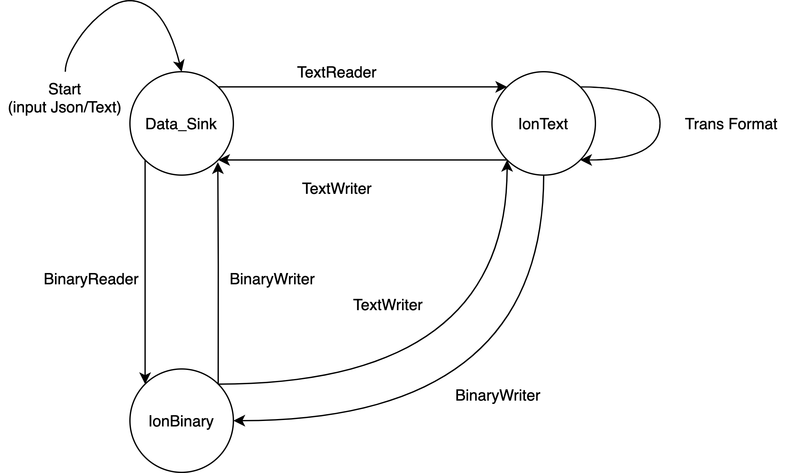

# Amazon Ion Java(261Poject)

A Java implementation of the [Ion data notation](http://amzn.github.io/ion-docs).

GitHub URL: [Ion-Java](https://github.com/chupengrocky/ion-java)

[](https://travis-ci.org/amzn/ion-java)
[](https://maven-badges.herokuapp.com/maven-central/com.amazon.ion/ion-java)
[](http://www.javadoc.io/doc/com.amazon.ion/ion-java)

1. [Part-1](#Part-1)
   1. [Project-Relevant](#Project-Relevant)
   2. [Previous-Test-Case](#Previous-Test-Case)
   3. [New-Test-Case](#New-Test-Case)
2. [Part-2](#Part-2)
   1. [Finite-State-Machine](#Finite-State-Machine)
   2. [Function-Model](#Function-Model)
   3. [FSM-Graph](#FSM-Graph)
   4. [Test-Case](#Test-Case)
3. [Part-3](#Part-3)
   1. [Structural-Testing](#Structural-Testing)
   2. [Previous-Test-Coverage](#Previous-Test-Coverage)
   3. [After-Test-Coverage](#After-Test-Coverage)
4. [Setup](#Setup)
5. [Pulling-in-Upstream-Changes](#Pulling-in-Upstream-Changes)
6. [Depending-on-the-Library](#Depending-on-the-Library)
7. [Using-the-Library](#Using-the-Library)


## Part-1

### Project-Relevant

**Purpose**: Amazon Ion is a [richly-typed](https://amzn.github.io/ion-docs/guides/why.html#rich-type-system), [self-describing](https://amzn.github.io/ion-docs/guides/why.html#self-describing), hierarchical data serialization format offering [interchangeable binary and text](https://amzn.github.io/ion-docs/guides/why.html#dual-format-interoperability) representations.

**Language:** Java

**Number of class**: 386

`find . -name '*.java' | wc -l`

**Lines of Codes:** 115233

`find . -name '*.java' | xargs wc -l`

### Previous-Test-Case

The test data is in another forked submodule [Ion-test](https://github.com/chupengrocky/ion-tests)

Current test cases covering the following aspect:

1. Low-level facilities.
2. General framework tests.
3. Type-based DOM tests.
4. Markup tests
5. Binary format tests
6. Utility tests
7. Equality tests
8. General processing test suite
9. Some tests are collected to make it easier to run interesting subsets.
10. experimental binary writer tests
11. Hash code tests
12. DOM Lifecycle / mode tests

### New-Test-Case

We explore the need for systematic functional testing and partition testing in this project and summarize the following idea:

1. It divides the input data of a software unit into partitions of  data from which test cases can be derived
2. If we systematically test some cases from each part, we will include the dense parts, which may lead to a error.

Here we choose the Ion Binary writer as the target and write four test case for testing our partitions and boundaries. We test its functionality with different type of input, size of input. And Finally we test the output with different settings. It is written in J-unit and run in IntelliJ IDEA.


## Part-2

### Finite-State-Machine

A **Finite State Machine**, or **FSM**, is a computation model that can be **used to** simulate sequential logic, or, in other words, to represent and control execution flow. When we need to test a software or a system, we can use FSM to represent the different stage of the system. Then we can write a table to check all the possible test case shown in the FSM graph.


### Function Model

Here we choose the function of reading and writing Ion data. It is the main function of Ion since the goal of Amazon Ion is to support the transformation between text format and binary representation. In our FSM, we define 3 states:

1. Data Sink(where we get the input and send the output)
2. Ion-text format(where the data is store in text format)
3. Ion-binary format(where the data is store in binary format)

The action/Edge we define in our FSM is related to Ion Reader and Writer:

1. Text Reader
2. Text Writer
3. Binary Reader
4. Binary Writer
5. Trans Format(The IonText format support pretty print Json for unformatted data)

### FSM-Graph



### Test-Case

For each of the state, we write a test case to check the edge for income data and outcome data:

```java
public class NewTestCase_part2 extends IonTestCase{
   @Test
   public void testFiniteStateMachineReader();
   @Test
   public void testFiniteStateMachineText()  throws Exception;
   @Test
   public void testFiniteStateMachineBinary()  throws Exception;
}
```

The detail of the code is in the NewTestCase_part2.java.


## Part-3

### Structural-Testing

Structural testing is the type of testing carried out to test the structure of code. It is also known as **White Box testing** or Glass Box testing. This type of testing requires knowledge of the code, so, it is mostly done by the developers. It helps test developer to reason carefully about the system implementation and reveals error in the hidden code. 

### Previous-Test-Coverage

1. We notice that the com.amazon.ion.apps package has the 0% coverage for class, method, line. Thus we add new test cases to cover some of its functionalities(test/AddTests.java). 
2. Under the package com.amazon.ion.impl, we find that the SimpleByteBuffer class is created but never be tested. So we write another test file NewTestCase_part2.java to increase its coverage rate

| [Package](IonTestCoverage/index.html)                        | [Class, %](IonTestCoverage/index_SORT_BY_CLASS.html) | [Method, %](IonTestCoverage/index_SORT_BY_METHOD.html) | [Line, %](IonTestCoverage/index_SORT_BY_LINE_DESC.html) |
| :----------------------------------------------------------- | :--------------------------------------------------- | :----------------------------------------------------- | :------------------------------------------------------ |
| [**com.amazon.ion.apps**](IonTestCoverage/com.amazon.ion.apps/index_SORT_BY_LINE.html) | **0% (0/ 5)**                                        | **0% (0/ 36)**                                         | **0% (0/ 271)**                                         |
| [com.amazon.ion.impl](IonTestCoverage/com.amazon.ion.impl/index_SORT_BY_LINE.html) | 79.4% (135/ 170)                                     | 68.7% (1451/ 2112)                                     | 63.3% (8463/ 13367)                                     |
| [com.amazon.ion.util](IonTestCoverage/com.amazon.ion.util/index_SORT_BY_LINE.html) | 94.7% (18/ 19)                                       | 70.6% (120/ 170)                                       | 78.4% (714/ 911)                                        |
| [com.amazon.ion.facet](IonTestCoverage/com.amazon.ion.facet/index_SORT_BY_LINE.html) | 100% (2/ 2)                                          | 55.6% (5/ 9)                                           | 84.6% (22/ 26)                                          |
| [com.amazon.ion.impl.lite](IonTestCoverage/com.amazon.ion.impl.lite/index_SORT_BY_LINE.html) | 95.5% (42/ 44)                                       | 88.6% (631/ 712)                                       | 86% (2808/ 3264)                                        |
| [com.amazon.ion.system](IonTestCoverage/com.amazon.ion.system/index_SORT_BY_LINE.html) | 92.3% (12/ 13)                                       | 92.6% (100/ 108)                                       | 90.9% (260/ 286)                                        |
| [com.amazon.ion](IonTestCoverage/com.amazon.ion/index_SORT_BY_LINE.html) | 85% (17/ 20)                                         | 81.8% (162/ 198)                                       | 91% (828/ 910)                                          |
| [com.amazon.ion.impl.bin](IonTestCoverage/com.amazon.ion.impl.bin/index_SORT_BY_LINE.html) | 93.9% (62/ 66)                                       | 83% (376/ 453)                                         | 91% (1871/ 2055)                                        |

| [Class](IonTestCoverage/index.html)                          | [Class, %](IonTestCoverage/index_SORT_BY_CLASS.html) | [Method, %](IonTestCoverage/index_SORT_BY_METHOD.html) | [Line, %](IonTestCoverage/index_SORT_BY_LINE_DESC.html) |
| :----------------------------------------------------------- | :--------------------------------------------------- | :----------------------------------------------------- | :------------------------------------------------------ |
| [**SimpleByteBuffer**](IonTestCoverage/.classes/SimpleByteBuffer.html) | **0% (0/ 4)**                                        | **0% (0/ 84)**                                         | **0% (0/ 606)**                                         |

We use Intellij to run the all the test with coverage and generate the following output: (The detailed output is stored under the "IonTestCoverage" folder)


### After-Test-Coverage

After adding the new test cases the cover rate becomes:

| [Package](IonTestCoverage/index.html)                        | [Class, %](IonTestCoverage/index_SORT_BY_CLASS.html) | [Method, %](IonTestCoverage/index_SORT_BY_METHOD.html) | [Line, %](IonTestCoverage/index_SORT_BY_LINE_DESC.html) |
| ------------------------------------------------------------ | ---------------------------------------------------- | ------------------------------------------------------ | ------------------------------------------------------- |
| [**com.amazon.ion.apps**](IonTestCoverage/com.amazon.ion.apps/index_SORT_BY_LINE.html) | **80% (4/5)**                                        | **20% (7/34)**                                         | **24% (72/295)**                                        |

| [Class](IonTestCoverage/index.html)                          | [Class, %](IonTestCoverage/index_SORT_BY_CLASS.html) | [Method, %](IonTestCoverage/index_SORT_BY_METHOD.html) | [Line, %](IonTestCoverage/index_SORT_BY_LINE_DESC.html) |
| :----------------------------------------------------------- | :--------------------------------------------------- | :----------------------------------------------------- | :------------------------------------------------------ |
| [**SimpleByteBuffer**](IonTestCoverage/.classes/SimpleByteBuffer.html) | **75% (3/ 4)**                                       | **23% (20/ 84)**                                       | **11% (75/ 606)**                                       |


## Setup

This repository contains a [git submodule](https://git-scm.com/docs/git-submodule)
called `ion-tests`, which holds test data used by `ion-java`'s unit tests.

The easiest way to clone the `ion-java` repository and initialize its `ion-tests`
submodule is to run the following command.

```
$ git clone --recursive https://github.com/amzn/ion-java.git ion-java
```

Alternatively, the submodule may be initialized independently from the clone
by running the following commands.

```
$ git submodule init
$ git submodule update
```

The submodule points to the tip of the branch of the `ion-tests` repository
specified in `ion-java`'s `.gitmodules` file.

`ion-java` may now be built and installed into the local Maven repository with
the following command.

```
$ mvn install
```

## Pulling-in-Upstream-Changes

To pull upstream changes into `ion-java`, start with a simple `git pull`.
This will pull in any changes to `ion-java` itself (including any changes
to its `.gitmodules` file), but not any changes to the `ion-tests`
submodule. To make sure the submodule is up-to-date, use the following
command.

```
$ git submodule update --remote
```

This will fetch and update the ion-tests submodule from the `ion-tests` branch
currently specified in the `.gitmodules` file.

For detailed walkthroughs of git submodule usage, see the
[Git Tools documentation](https://git-scm.com/book/en/v2/Git-Tools-Submodules).

## Depending-on-the-Library

To start using `ion-java` in your code with Maven, insert the following
dependency into your project's `pom.xml`:

```
<dependency>
  <groupId>com.amazon.ion</groupId>
  <artifactId>ion-java</artifactId>
  <version>1.8.0</version>
</dependency>
```

#### Legacy group id

Originally ion-java was published using the group id `software.amazon.ion`. Since 1.4.0 the
official groupId was changed to `com.amazon.ion` to be consistent with other Amazon open
source libraries. We still maintain the legacy group id but strongly encourage users to migrate
to the official one.

## Finite-State-Machine

## Using-the-Library

A great way to get started is to use the [Ion cookbook](http://amzn.github.io/ion-docs/cookbook.html).
The [API documentation](http://www.javadoc.io/doc/com.amazon.ion/ion-java) will give a lot
of detailed information about how to use the library.